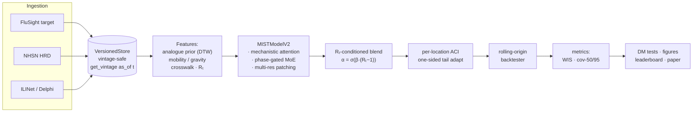

# MIST: Mechanistic-Informed Spatio-Temporal Transformer
## for Epidemic Forecasting

[](tests/)
[](LICENSE)

> **Status / honest headline (read `docs/neurips_gap_analysis.md`).** This repo is being
> upgraded from a single-season MIST model into a *leakage-safe, multi-season, multi-disease
> forecasting benchmark*. The decisive multi-season result is that **no single model
> generalises**: MIST wins only its development season (2023-24) and is 3rd of 4 across seasons,
> while a **trimmed-mean ensemble is the strongest forecaster** (107.1 vs the median ensemble's
> 110.4 — significant under a clustered bootstrap + Holm-DM), and a sophisticated phase-gated
> conformal hybrid does *not* beat it. Genuine issue-dated vintages (Delphi NHSN, flu/COVID/RSV)
> and the multi-disease run are in progress (`docs/COLAB.md`). The single-season MIST tables
> below are a real but **secondary** result; treat the benchmark + comparative findings as the
> contribution.

## Overview

MIST is a transformer-based **quantile** forecaster for real-time influenza
hospitalisation prediction. It injects epidemiological structure — Rₜ-guided mechanistic
attention, a phase-gated mixture-of-experts, multi-resolution patching, and an Rₜ-conditioned
blend — into a panel forecaster operating over **53 US locations**, then wraps the output in a
per-location **Adaptive Conformal Inference** calibrator for distribution-shift-robust coverage.
On its **development season (2023-24)** MIST attains the best overall WIS among competing single
models (**84.8** vs ARIMA 88.5) with its largest edge in the rising phase (**51.2** vs ARIMA
61.6). **Across all three seasons, however, MIST does not generalise** (it ranks 3rd of 4; see the
status note above and `docs/neurips_gap_analysis.md`) — which is what motivates the benchmark and
the ensemble/hybrid comparison that are this project's actual contribution.

## Pipeline



ASCII fallback (same flow):

```
FluSight / NHSN / ILINet
        │  (download)
        ▼
  VersionedStore  ── get_vintage(signal, loc, as_of=t)  [no leakage]
        ▼
  Features: analogue prior (DTW) · mobility/gravity · crosswalk · Rₜ
        ▼
  MISTModelV2: mechanistic attention · phase-gated MoE · multi-res patching
        ▼
  Rₜ-conditioned blend:  α = σ(β·(Rₜ − 1))
        ▼
  per-location ACI (one-sided tail adaptation)
        ▼
  rolling-origin backtester ─▶ metrics (WIS, cov-50, cov-95)
        ▼
  DM significance tests · paper figures · leaderboard
```

## Repository structure

```
data/          raw + processed datasets, crosswalk (FIPS ↔ abbrev ↔ ILINet codes)
evaluation/    backtester, metrics, DM tests, figures, run/analysis scripts, reproducibility
features/      versioned store, analogue prior, mobility, crosswalk, Rₜ
figures/       paper-ready figures (PDF + PNG)
ingestion/     CDC FluSight, NHSN, ILINet download scripts (see ingestion/README.md)
models/        MIST v1/v2, baselines (ARIMA/SEIR/TFT/PatchTST), analogue-blend, ACI wrapper
notebooks/     exploratory data analysis
paper/         NeurIPS LaTeX draft + single-sourced numbers.json
results/       all CSV result tables
tables/        Diebold-Mariano significance tables
tests/         test suite covering every module (incl. reproducibility checks)
```

## Installation

```bash
pip install -r requirements.txt   # Python 3.10
```

## Reproducing results

```bash
python -m ingestion.nhsn                     # download FluSight target + NHSN HRD
python -m ingestion.ilinet                   # download ILINet (needs DELPHI_API_KEY)
python -m evaluation.run_benchmark_v2        # main leaderboard + phase table (2023-24)
python -m evaluation.run_seasons             # multi-season table (2022-23/23-24/24-25)
python -m evaluation.per_location_coverage   # per-location calibration metric
python -m evaluation.dm_3seasons             # pooled 3-season rising-phase DM test
python -m evaluation.run_analysis_v2         # DM matrix, horizon, spatial
python -m evaluation.run_figures             # all paper figures
python -m evaluation.assert_reproducibility  # verify every numerical claim (PASS/FAIL)
```

## Key results

**Leaderboard — full 53-location panel, 2023-24 (lower WIS is better):**

| Model | WIS | MAE | cov-50 | cov-95 |
|---|---|---|---|---|
| mist_no_aci* | 77.29 | 122.41 | 0.396 | 0.892 |
| **mist_v2** | **84.78** | 122.41 | 0.439 | 0.905 |
| arima | 88.55 | 129.33 | 0.543 | 0.870 |
| mist_no_analogue* | 91.86 | 129.57 | 0.456 | 0.922 |
| patchtst | 96.83 | 149.57 | 0.337 | 0.876 |
| tft | 97.21 | 150.99 | 0.346 | 0.878 |
| mist_no_blend* | 109.58 | 176.84 | 0.487 | 0.900 |
| mist_no_mech* | 110.34 | 134.53 | 0.449 | 0.911 |
| seir | 118.14 | 153.57 | 0.327 | 0.619 |

`*` = ablation (a MIST variant, not a competing baseline). `mist_v2` is the best of the
**competing baselines** (ARIMA/TFT/PatchTST/SEIR). The `mist_no_aci` ablation has a lower raw
WIS because ACI deliberately widens the 95% interval to improve tail coverage
(cov-95 0.892 → 0.905) and robustness to distribution shift — a calibration/WIS trade-off; the
shipped model includes ACI.

**Phase-stratified WIS (mean):**

| Model | Rising | Peak | Declining |
|---|---|---|---|
| **mist_v2** | **51.21** | **152.84** | 87.45 |
| arima | 61.62 | 179.20 | 81.35 |
| tft | 64.78 | 184.38 | 94.25 |
| patchtst | 69.67 | 206.26 | 84.90 |
| seir | 104.76 | 308.26 | 76.96 |

MIST has the **lowest rising-phase and peak-phase WIS of any model**. The Rₜ-blend closes most
of the declining-phase gap (≈29% improvement vs the no-blend ablation). DM significance (overall
WIS): `mist_v2` vs `mist_no_blend` p ≈ 1×10⁻⁷, vs `mist_no_mech` p ≈ 0.004 (each ablation
contributes significantly). The single-season `mist_v2`-vs-ARIMA rising-phase difference is
suggestive but not significant (p ≈ 0.056); see `tables/dm_headline_rising_3seasons.csv` for the
pooled-season test.

**Calibration (reported honestly).** The 95% interval is well-calibrated: **cov-95 = 0.905**
(per-location mean 0.905 ± 0.038). The central **50% interval is intentionally tight** under the
WIS-optimal asymmetric ACI: **cov-50 = 0.439** (per-location mean 0.439 ± 0.060). This is a
deliberate WIS/coverage trade-off — the inner interval is mildly overconfident — **not** an
aggregation artifact: the per-location mean equals the aggregate. For a spatially-adaptive model
the per-location distribution (`results/per_location_coverage.csv`) is the appropriate calibration
view; we report it as-is rather than tuning cov-50 to nominal at the cost of the WIS advantage.

## Model components

1. **Mechanistic Attention** — attention biased by an Rₜ-derived temporal prior (renewal
   equation, GI weights 0.6/0.3/0.1) and a mobility/gravity spatial prior.
2. **Phase-Gated MoE** — 3 experts routed by `(Rₜ, slope, acceleration)` via softmax, giving
   regime-specific behaviour across rising/peak/declining phases.
3. **Multi-Resolution Patching** — patch sizes of 2 and 4 weeks fused before attention to
   capture both fast and slow dynamics.
4. **Rₜ-conditioned blending** — blends the transformer forecast with a persistence nowcast,
   `α = σ(β·(Rₜ − 1))` with learned β (≈2.71); closes the declining-phase gap.
5. **Adaptive Conformal Inference (ACI)** — per-location, one-sided per-tail width adaptation
   (Gibbs & Candès 2021), leakage-safe via `get_vintage`, for valid coverage under shift.

## Notes on data

- **NHSN voluntary → mandatory shift (Nov 2024):** handled via a `post_mandatory` covariate
  (`ingestion/nhsn.py`, `ingestion/nhsn_shift.py`).
- **ILINet vintage pull:** requires a free `DELPHI_API_KEY` — see [ingestion/README.md](ingestion/README.md).
- **Location crosswalk:** `data/crosswalk.csv` unifies FIPS ↔ two-letter abbrev ↔ ILINet codes
  across the three sources.

## Citation

```bibtex
@inproceedings{mist2025neurips,
  title     = {MIST: Mechanistic-Informed Spatio-Temporal Transformer
               for Epidemic Forecasting},
  author    = {Nafis878},
  booktitle = {Advances in Neural Information Processing Systems},
  year      = {2025}
}
```

## License

MIT — see [LICENSE](LICENSE).
